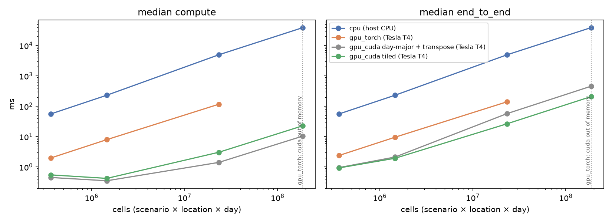
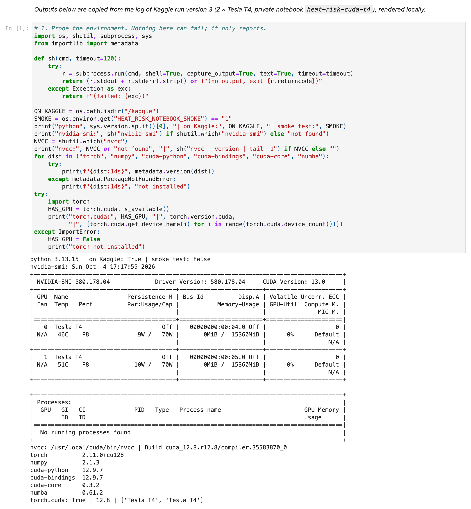
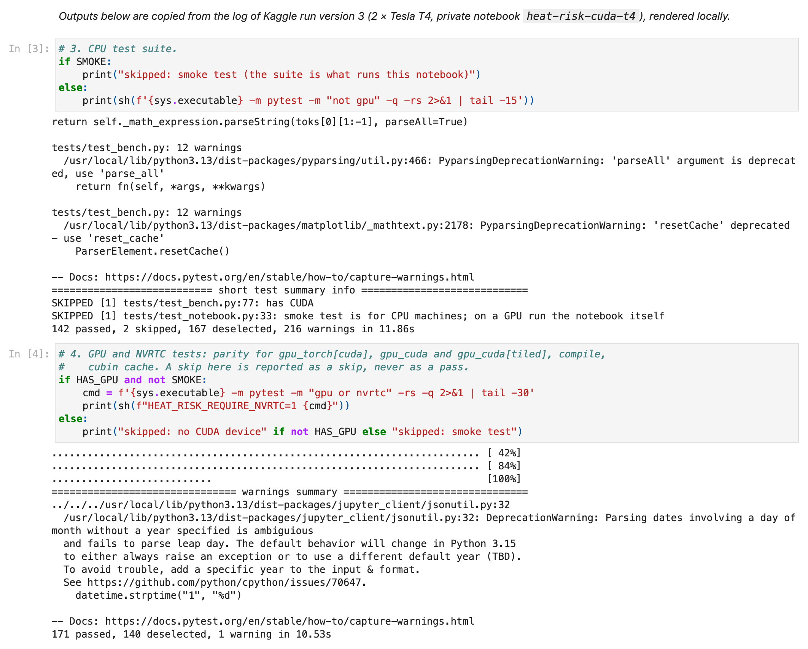
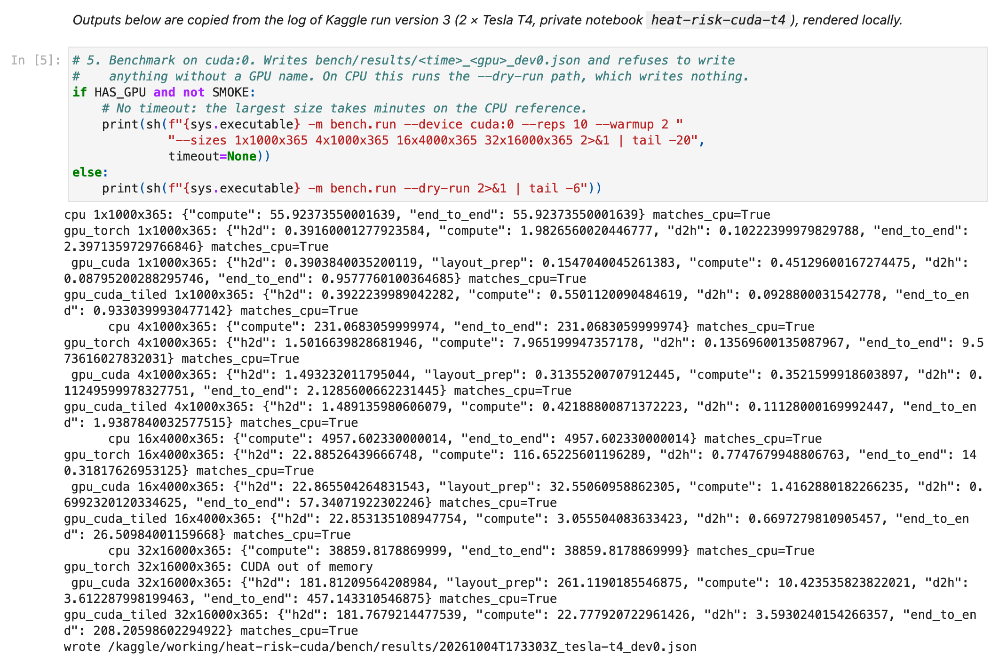

# heat-risk-cuda

An independent student project using NVIDIA's open-source CUDA Python tooling. NVIDIA did not
create, endorse, or sponsor it.

It counts heat-hazard days (TX90, TX95, hot nights, heat index ≥ 32 °C) and their longest
consecutive runs over arrays shaped `[scenario, location, day]`, and compares three
implementations of the same specification:

| Name | What it is | Custom kernel? |
|---|---|---|
| `cpu` | NumPy reference implementation | no |
| `gpu_torch` | Ordinary PyTorch library ops | no: library ops baseline, not a custom kernel |
| `gpu_cuda` | CUDA C++ kernels compiled at runtime with NVIDIA `cuda.core` (NVRTC); a shared-memory tiled kernel by default | yes |

## Status and honesty

- All three implementations are written and tested. On a Kaggle Tesla T4 both custom kernels
  passed every GPU test (171 passed in the latest run) and were benchmarked; see the results
  below and STATUS.md.
- The hazard definitions are in [docs/hazards.md](docs/hazards.md). They are project
  simplifications, not ETCCDI indices.
- **Nothing has been measured on a GPU yet.** No speedup is claimed until it is measured, and
  any benchmark table in this README will be generated from JSON files written by real GPU runs.
- All data is synthetic (seeded generator).

## What has and has not been measured

| Claim | Status |
|---|---|
| `cpu` matches hand-computed cases, NWS chart values and property tests | verified on CPU (macOS and Linux CI) |
| `gpu_torch` matches `cpu` | verified on CPU tensors and on a Kaggle Tesla T4 |
| `gpu_cuda` kernel compiles for sm_75, float32 and float64, no `fma` in the PTX | verified in Linux CI with NVRTC, no GPU |
| `gpu_cuda` produces correct results | verified on a Kaggle Tesla T4 for both kernels (tiled and day-major): all parity, tile-edge and edge-case tests pass, float32 and float64 |
| Timings on a Tesla T4 | measured in two Kaggle sessions (10 reps each, float32); table below |

Only what the table shows is claimed. Compute-only, layout prep, transfers and end-to-end time
are reported separately, and a GPU result slower than `cpu` would be reported as data. Not
measured: other GPUs, float64 timings, the second T4, and an optimised
multi-threaded CPU baseline (`cpu` is a straightforward NumPy reference, so speedups against it
overstate what a tuned CPU implementation would show).

## How to reproduce on Kaggle

Kaggle's free GPU tier offers **T4x2** (two Tesla T4, 16 GB each, compute capability 7.5 /
`sm_75`). Per [Kaggle's GPU documentation](https://www.kaggle.com/docs/efficient-gpu-usage) (as summarised in October 2026) the quota is about **30 GPU hours per week** with sessions
of up to **12 hours**, and accelerators require a phone-verified account.

1. Create a new Kaggle notebook and import `notebooks/kaggle_heat_risk_cuda.ipynb` from this repo.
2. Settings: Accelerator **GPU T4 x2**, Internet **on**.
3. Run all. The notebook probes the environment (`nvidia-smi`, `nvcc`, package versions), clones
   the repo, installs it with the pinned `cuda-core[cu12]==1.2.1`, runs the CPU and GPU test
   suites, benchmarks on `cuda:0`, and copies results to `/kaggle/working/results/`.
4. Download the results, put the JSON in `bench/results/`, run `python -m bench.make_table`, and
   commit the JSON and README together.

The Triton language is not used (its Turing/sm_75 support was dropped in Triton 3.3). It is a
different thing from NVIDIA Triton Inference Server, which is also not used.

## Benchmark results



Two Kaggle T4 runs, read straight from the JSON files (the plot shows the latest):

- Every GPU result in both runs matched the `cpu` reference exactly.
- **Run 1** (version 2) found the bottleneck. At the largest size (32×16000×365, 187 million
  cells) the day-major kernel computed in 10.4 ms, but the GPU transpose that feeds it took
  261 ms of the 457.6 ms end to end. `gpu_torch` ran out of GPU memory at that size, as
  estimated in [docs/design.md](docs/design.md).
- **Run 2** (version 3) measured the fix, a shared-memory tiled kernel that reads the original
  layout. End to end it took 208.2 ms against 457.1 ms (2.2× faster) at the largest size, and
  26.5 ms against 57.3 ms at 16×4000×365. Its own compute is slower (22.8 ms against 10.4 ms),
  which the removed transpose more than pays for. At the two small sizes the two are within
  0.2 ms of each other. The tiled kernel is now the default.
- The day-major end-to-end times repeated across the two sessions within 0.1% at the largest
  size and within about 4% at the smaller ones.
- At the largest size the host-to-device copy (182 ms) is now 87% of end-to-end time. That is
  close to what PCIe 3 can move, so further gains need the data to start on the GPU.
- Against the PyTorch library ops baseline at 16×4000×365: compute 3.06 ms against 116.7 ms,
  end to end 26.5 ms against 140.3 ms (about 5.3×).

<!-- bench-table:start -->
Generated from `bench/results/*.json` by `python -m bench.make_table`. Times are medians in milliseconds. A GPU result slower than `cpu` is reported as measured. No speedup is claimed beyond these measurements.

**Tesla T4** (device 0, driver 580.178.04), torch 2.11.0+cu128, cuda-core 1.2.1, float32, fma=off, 10 reps, 2026-10-04T16:32:27Z, `20261004T163227Z_tesla-t4_dev0.json`

| impl | size (S×L×D) | h2d | layout_prep | compute | d2h | end_to_end | matches cpu |
|---|---|---|---|---|---|---|---|
| cpu | 1×1000×365 |  |  | 55.446 |  | 55.446 | yes |
| gpu_torch | 1×1000×365 | 0.397 |  | 2.047 | 0.094 | 2.389 | yes |
| gpu_cuda | 1×1000×365 | 0.396 | 0.160 | 0.467 | 0.103 | 0.966 | yes |
| cpu | 4×1000×365 |  |  | 249.319 |  | 249.319 | yes |
| gpu_torch | 4×1000×365 | 1.513 |  | 7.948 | 0.126 | 9.559 | yes |
| gpu_cuda | 4×1000×365 | 1.514 | 0.338 | 0.396 | 0.126 | 2.221 | yes |
| cpu | 16×4000×365 |  |  | 5164.138 |  | 5164.138 | yes |
| gpu_torch | 16×4000×365 | 23.160 |  | 116.636 | 0.701 | 140.553 | yes |
| gpu_cuda | 16×4000×365 | 23.156 | 32.567 | 1.378 | 0.694 | 57.659 | yes |
| cpu | 32×16000×365 |  |  | 40259.846 |  | 40259.846 | yes |
| gpu_torch | 32×16000×365 | CUDA out of memory |  |  |  |  | n/a |
| gpu_cuda | 32×16000×365 | 182.176 | 261.127 | 10.421 | 3.541 | 457.571 | yes |

**Tesla T4** (device 0, driver 580.178.04), torch 2.11.0+cu128, cuda-core 1.2.1, float32, fma=off, 10 reps, 2026-10-04T17:33:03Z, `20261004T173303Z_tesla-t4_dev0.json`

| impl | size (S×L×D) | h2d | layout_prep | compute | d2h | end_to_end | matches cpu |
|---|---|---|---|---|---|---|---|
| cpu | 1×1000×365 |  |  | 55.924 |  | 55.924 | yes |
| gpu_torch | 1×1000×365 | 0.392 |  | 1.983 | 0.102 | 2.397 | yes |
| gpu_cuda | 1×1000×365 | 0.390 | 0.155 | 0.451 | 0.088 | 0.958 | yes |
| gpu_cuda_tiled | 1×1000×365 | 0.392 |  | 0.550 | 0.093 | 0.933 | yes |
| cpu | 4×1000×365 |  |  | 231.068 |  | 231.068 | yes |
| gpu_torch | 4×1000×365 | 1.502 |  | 7.965 | 0.136 | 9.574 | yes |
| gpu_cuda | 4×1000×365 | 1.493 | 0.314 | 0.352 | 0.112 | 2.129 | yes |
| gpu_cuda_tiled | 4×1000×365 | 1.489 |  | 0.422 | 0.111 | 1.939 | yes |
| cpu | 16×4000×365 |  |  | 4957.602 |  | 4957.602 | yes |
| gpu_torch | 16×4000×365 | 22.885 |  | 116.652 | 0.775 | 140.318 | yes |
| gpu_cuda | 16×4000×365 | 22.866 | 32.551 | 1.416 | 0.699 | 57.341 | yes |
| gpu_cuda_tiled | 16×4000×365 | 22.853 |  | 3.056 | 0.670 | 26.510 | yes |
| cpu | 32×16000×365 |  |  | 38859.818 |  | 38859.818 | yes |
| gpu_torch | 32×16000×365 | CUDA out of memory |  |  |  |  | n/a |
| gpu_cuda | 32×16000×365 | 181.812 | 261.119 | 10.424 | 3.612 | 457.143 | yes |
| gpu_cuda_tiled | 32×16000×365 | 181.768 |  | 22.778 | 3.593 | 208.206 | yes |
<!-- bench-table:end -->

## Development

```bash
pip install torch --index-url https://download.pytorch.org/whl/cpu   # CPU-only torch
pip install -e ".[dev]"
ruff check && mypy src && pytest -m "not gpu"
```

The `gpu` extra (`cuda-core[cu12]`) installs only on Linux and Windows.

## Screenshots from the Kaggle run

Outputs are copied from the log of the latest Kaggle run (version 3, private notebook) and
rendered locally; only the notebook is shown.

| Environment | Tests | Benchmark |
|---|---|---|
|  |  |  |

## Acknowledgments

- **Heat index:** the US National Weather Service heat index algorithm (the Rothfusz regression
  with Steadman's simple formula and the NWS adjustments), as published at
  https://www.wpc.ncep.noaa.gov/html/heatindex_equation.shtml.
- **Index definitions:** the ETCCDI climate change indices, used as the reference point that this
  project's simplified TX90/TX95 and hot-night definitions are compared against.
- **Tooling:** NumPy, PyTorch, Hypothesis, pytest, ruff and mypy. The custom kernel (in progress)
  uses NVIDIA's open-source CUDA Python tooling (`cuda.core`). This is an independent project;
  NVIDIA did not create, endorse, or sponsor it.
- **Compute:** GitHub Actions runs the CPU test suite; GPU tests and measurements ran on Kaggle's free
  T4 notebooks.
- Developed with AI coding assistance; the author specified the design, reviewed the code, and
  runs all GPU measurements.
